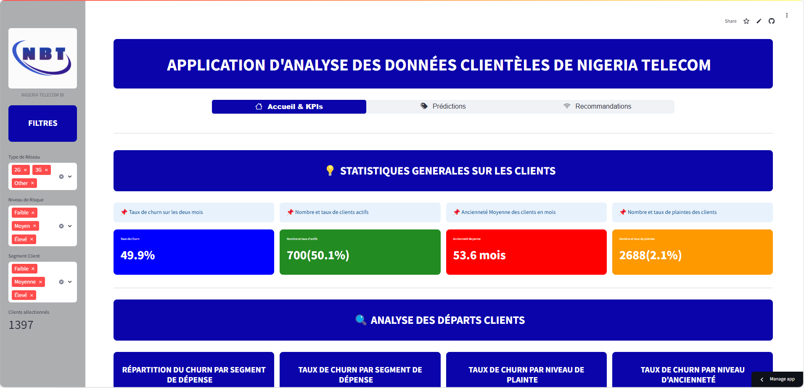
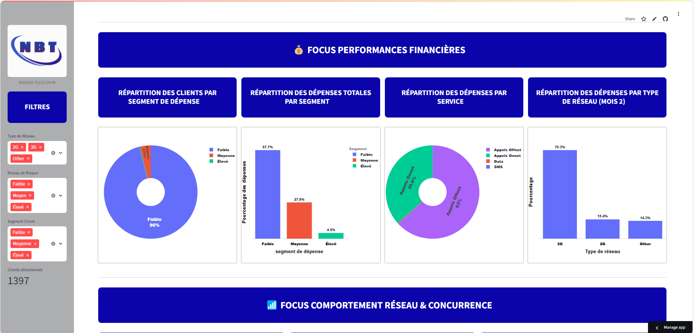
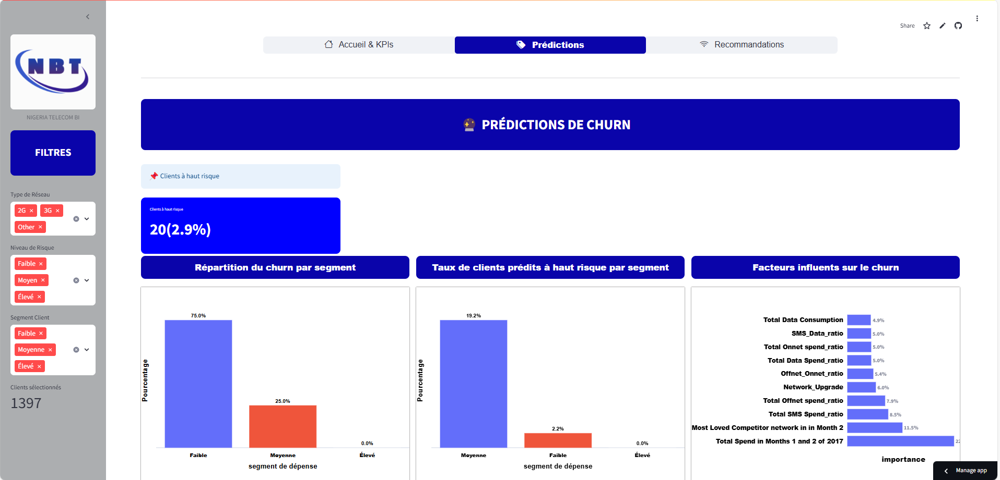
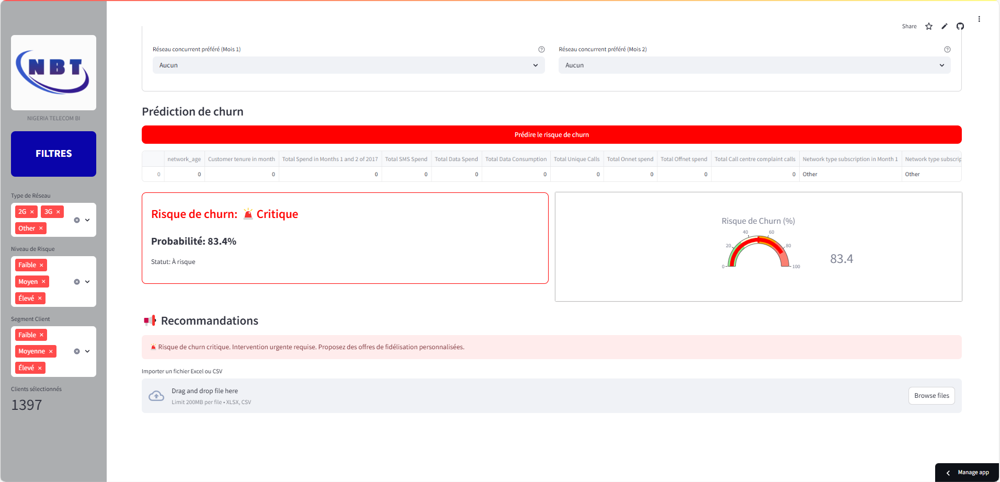
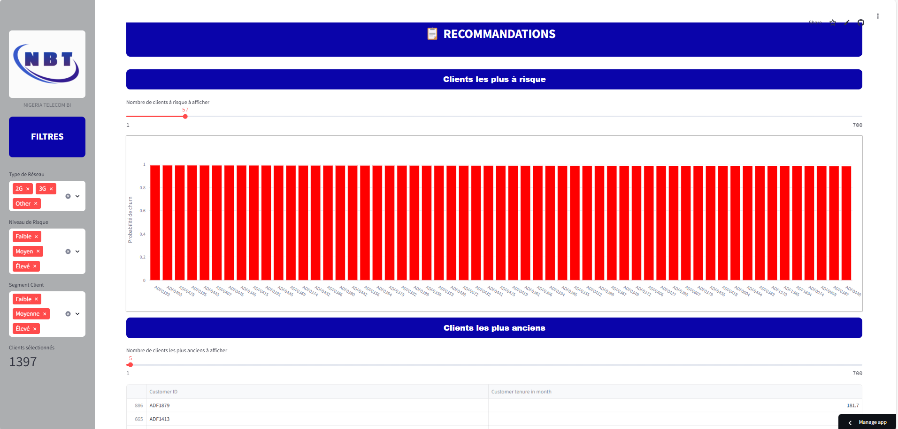

# 📊 TELECOM CHURN

### 📌 Contexte
Ce projet a été réalisé dans le cadre d’un hackathon organisé à l’ENSAE. Il vise à prédire le churn (le départ de clients) à partir de données télécoms, afin d’aider l’entreprise à mieux cibler ses actions de fidélisation.

lien vers l'application [nigeria_telecom_bi.app](https://nigeriatelecombi.streamlit.app/)


## Table des matieres
- [Objectif](#objectif)
- [Structure du projet](#structure-du-projet)
- [Methodologie](#methodologie)
- [Execution du projet](#execution-du-projet)
- [Application](#application)
- [Auteurs](#auteurs)

## 🧠 Objectifs

Dans un secteur aussi concurrentiel que celui des télécommunications, la volatilité des clients pousse les opérateurs à miser sur la fidélisation proactive. Mais encore faut-il savoir qui risque de partir, quand, et pourquoi.  Nous disposons d’un jeu de données du hackathon de Data Science Nigeria en 2018 portant sur les informations de consommateurs d’une entreprise locale.  Notre problématique se décline comme suit : peut-on, grâce aux données disponibles, prédire de manière fiable le départ potentiel d’un client ?

Notre projet s’inscrit dans le domaine de la Business Intelligence. Il vise à prévoir le risque de churn à partir des données de consommation des clients. L’objectif ultime étant de fournir à l’opérateur des leviers d’action concrets pour retenir ses clients, en exploitant les informations disponibles. Plus spécifiquement, il s’agit de : 
•	Concevoir une solution de machine learning capable de prédire le churn à partir de données clients préalablement traitées ;
•	Fournir un outil d’aide à la décision utilisable par les équipes métier via une interface intuitive. 


## 📌 Structure du projet 

1. Le dossier `CHURN` contient les notebooks de traitement des donnees et du choix du modeles ainsi que les données utilisées pour le traitement et la modélisation.

2. Le dossier `dossier_app_streamlit` contient tous les scripts de l'application streamlit.

## 🛠 Méthodologie

Partant de notre base de données, notre démarche s’est articulée autour de quatre étapes clés : l’exploration des données, le prétraitement (nettoyage, encodage, normalisation), la modélisation (tests de plusieurs algorithmes supervisés) et l’évaluation des performances à l’aide de métriques adaptées (précision, F1-score, ROC AUC). Chaque étape a été guidée par l’objectif d’optimiser la prédiction du churn tout en assurant l’interprétabilité des résultats.

🚀 Modèle final retenu : **XGBoost**
Accuracy : **84,1 %**

F1-score : **82,7 %**

AUC-ROC : **91,8 %**

Optimisé avec GridSearchCV

## 📌 Installation et Configuration

1. Clonez le dépôt et placez-vous dans le dossier AuchanScraping via un terminal :
   ```bash
   git clone https://github.com/LarrySANDJO/Telecom_churn
   ```

2. Créez un environnement virtuel et activez-le :

   ```bash
   python -m venv venv
   source venv\bin\activate    # Sur MacOS/Linux
   source venv/Scripts/activate       # Sur Windows
   ```

3. Installez les dépendances :
   ```bash
   pip install -r requirements.txt
   ```

## 📌 Application

Pour une visualisation instantanée des dynamiques réseau et une transformation rapide des données complexes en insights actionnables pour une prise de décision stratégique, le dashboard est l’outil idéal. Un dashboard  a donc été développé avec Streamlit, un framework Python simple et puissant qui permet de créer des interfaces web interactives pour la data science et le machine learning. Grâce à Streamlit, les utilisateurs peuvent visualiser des données, interagir avec des modèles prédictifs et explorer des résultats en temps réel, le tout sans avoir besoin de compétences en développement web. 
Dédié à l'analyse et la prédiction de l’attrition client, ce dashboard s'articule autour de trois pages principales :

- Page d’accueil et d’indicateurs de performances (KPIs) :



- Page de prédictions



- Page des recommandations



## ✅ Recommandations
À partir des résultats du modèle, plusieurs pistes d’action ont été proposées, comme :

- Renforcer les offres pour les clients à risque

- Améliorer la qualité du réseau dans les zones critiques

- Adapter les campagnes marketing selon le profil de l’utilisateur


## 📌 Auteurs 

Les auteurs de ce projet sont essentiellement les _eleves ingenieurs statisticiens economistes_ d'ISE2 2024-2025. Il s'agit de :

- KENNE YONTA Lesline Meralda 
- MATANG KUETE Josette Victoire
- SANDJO Larry Shuman 

*Élèves Ingénieurs Statisticiens Économistes en deuxième année de formation*


**Suggestions et Remarques**

Nous sommes ouverts à toutes les suggestions et remarques qui pourraient améliorer ce projet. N'hésitez pas à partager vos idées, retours ou signaler des problèmes en ouvrant une *issue* sur ce dépôt. Nous ferons de notre mieux pour y répondre rapidement et intégrer vos retours. Merci.